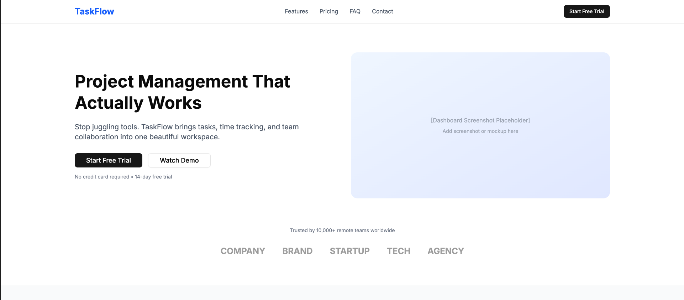
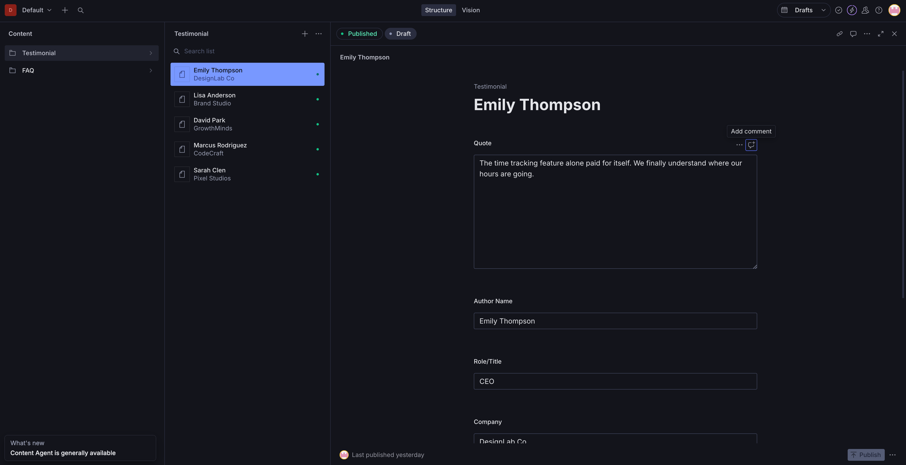
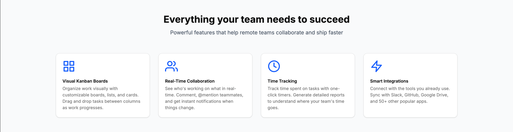
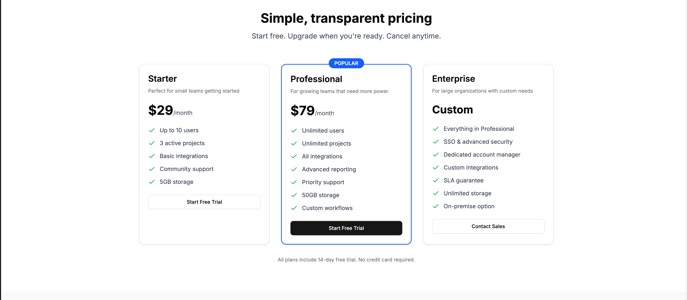

# Modern Landing CMS

A modern, fully CMS-powered landing page built with Next.js and Sanity. Every section is editable through the Sanity Studio—no code changes required to update content.

**[View Live Demo →](https://modern-landing-cms.vercel.app)**



## Features

- **Fully CMS-Managed** - Hero, features, pricing, testimonials, and FAQs all editable in Sanity Studio
- **Modern Stack** - Next.js 16, React 19, Tailwind CSS v4
- **Smooth Animations** - Framer Motion scroll animations and transitions
- **Mobile Responsive** - Optimized for all screen sizes with hamburger navigation
- **SEO Ready** - Open Graph, Twitter Cards, sitemap, and robots.txt
- **Loading States** - Skeleton loaders for better perceived performance
- **Error Handling** - Graceful fallbacks if CMS is unavailable

## Screenshots

| Landing Page | Sanity Studio |
|--------------|---------------|
|  |  |

| Features | Pricing |
|----------|---------|
|  |  |

## Tech Stack

- **Framework**: Next.js 16 (App Router)
- **CMS**: Sanity (embedded Studio)
- **Styling**: Tailwind CSS v4
- **Animations**: Framer Motion
- **UI Components**: Radix UI primitives

## Getting Started

### Prerequisites

- Node.js 18+
- A Sanity project (create one at [sanity.io](https://www.sanity.io))

### Setup

1. Clone the repository

2. Install dependencies:
   ```bash
   npm install
   ```

3. Copy the environment template and add your Sanity credentials:
   ```bash
   cp .env.example .env.local
   ```
   Then edit `.env.local` with your project ID and dataset from [sanity.io/manage](https://www.sanity.io/manage).

4. Start the development server:
   ```bash
   npm run dev
   ```

5. Open [http://localhost:3000](http://localhost:3000) for the landing page

6. Open [http://localhost:3000/studio](http://localhost:3000/studio) for the Sanity Studio

## Content Management

The Sanity Studio at `/studio` allows you to manage all landing page content:

| Content Type | Description |
|--------------|-------------|
| **Hero Content** | Headline, subheadline, CTA buttons, hero image, company logos |
| **Features** | Product features with icons, titles, and descriptions |
| **Pricing Plans** | Pricing tiers with features list and CTA |
| **Testimonials** | Customer quotes with author info and avatars |
| **FAQs** | Questions with rich text answers (supports links, formatting) |

All content types support ordering via a drag-and-drop `order` field.

## Project Structure

```
src/
├── app/                  # Next.js pages
│   ├── page.tsx          # Landing page
│   ├── studio/           # Embedded Sanity Studio
│   ├── sitemap.ts        # Dynamic sitemap
│   └── robots.ts         # Robots.txt config
├── components/           # React components
│   └── ui/               # Reusable UI primitives
└── sanity/
    ├── schemaTypes/      # Content schemas
    └── lib/              # Sanity client & utilities
```

## Deployment

Deployed on Vercel: **[modern-landing-cms.vercel.app](https://modern-landing-cms.vercel.app)**

Deploy your own:

[](https://vercel.com/new/clone?repository-url=https://github.com/robKasper/modern-landing-cms)

Remember to add your environment variables in the Vercel dashboard.
